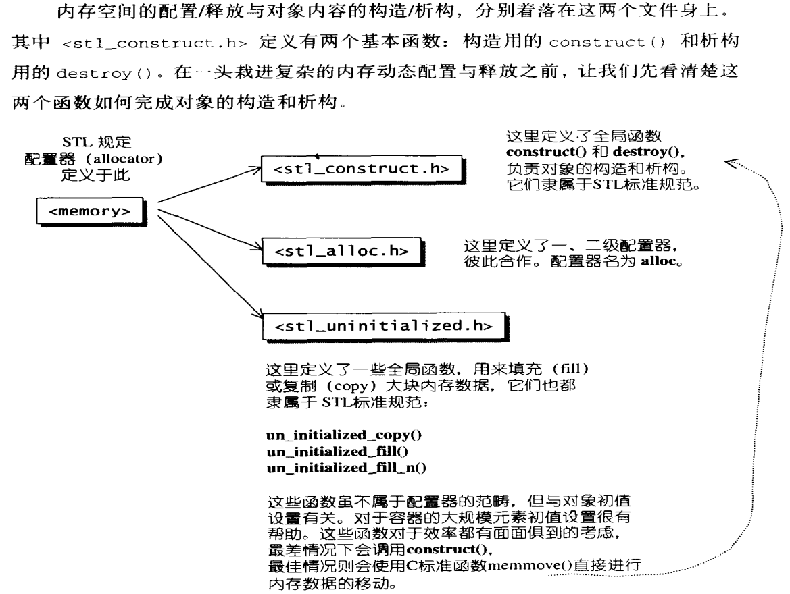
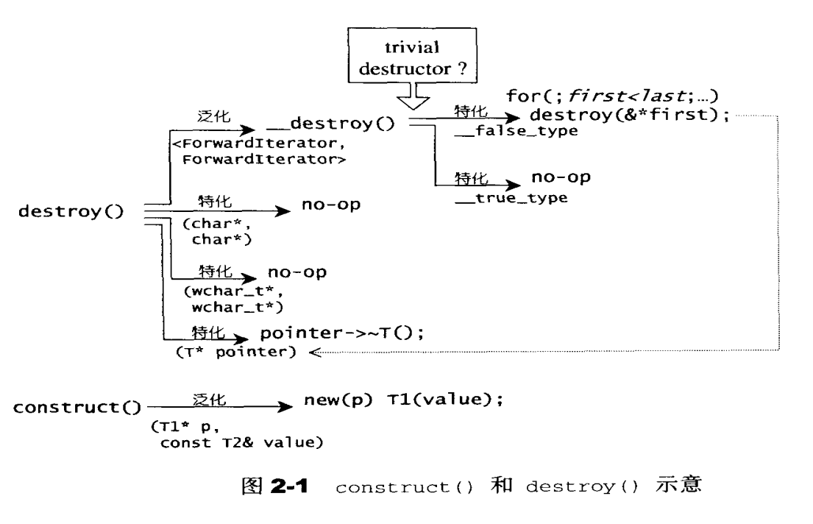
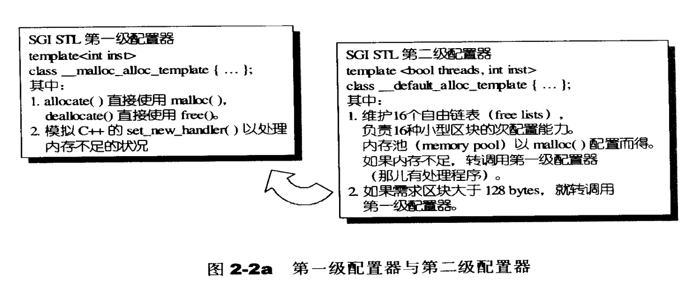
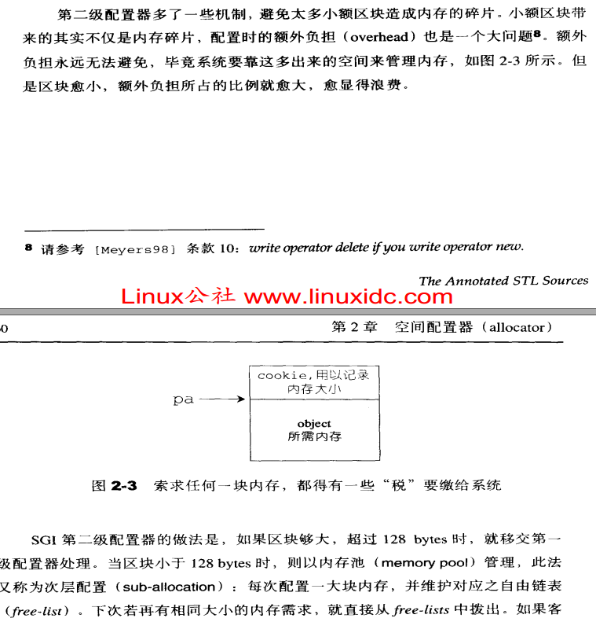
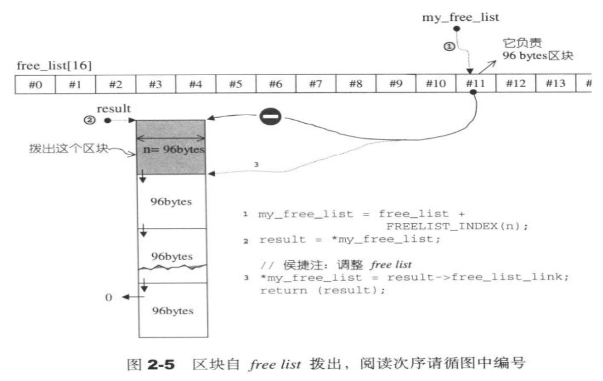
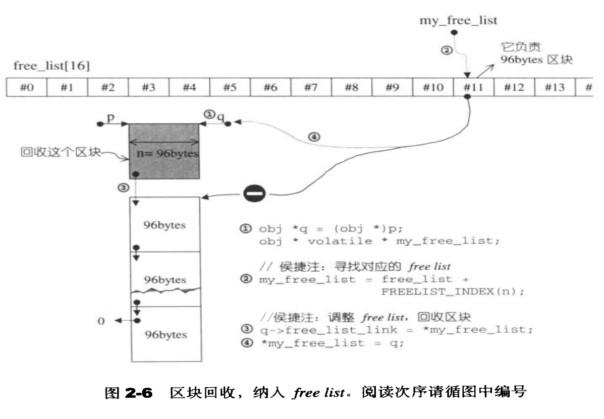
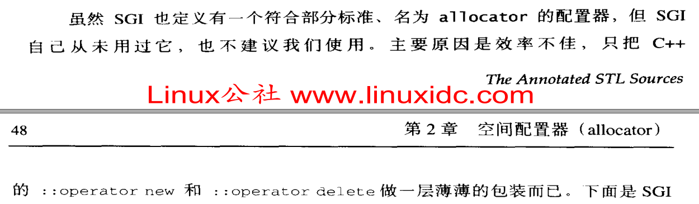
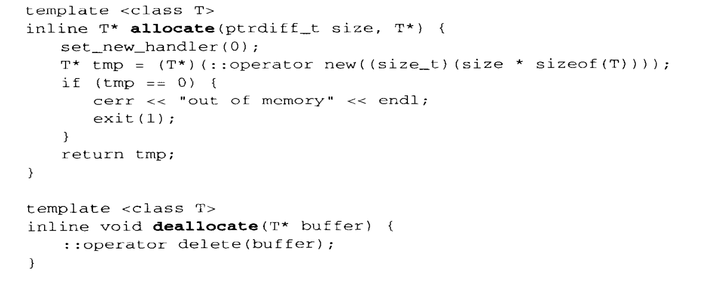

### stl空间配置模式
#### <<<stl源码剖析>>> p50: 

可以看到, 分为构造、析构、分配内存、内存回收 

1. 构造, 使用`placement new` 

2. 析构, 分为多个版本, 其中比较重要的是判断类的析构函数是否具有`trivial`属性 
#### <<<stl源码剖析>>> p52: 

3. 使用`C malloc`分配内存 

4. 使用`C free`释放内存 

### std::alloc空间配置器
#### <<<stl源码剖析>>> p55: 

 

1. 一级空间配置器, 申请内存大于`128K`的时候使用 

2. 二级空间配置器, 申请内存小于`128K`的时候使用, 并采用内存池来实现, 目的, 减少内存碎片和减少操作系统维护小内存块的负担 
#### <<<stl源码剖析>>> p59: 

3. 内存池提供空间:
#### <<<stl源码剖析>>> p63: 

4. 内存池回收空间:
#### <<<stl源码剖析>>> p65: 

### 为何不用std::allocator
#### <<<stl源码剖析>>> p48: 

1. `std::allocator`只是对`::operator new`和`::operator delete`做了一层封装 

2. 如何封装`allocate`和`deallocate`: 

#### <<<stl源码剖析>>> p48: 

注意, `deallocate()`中的T实际上是`void`型(如果看完书本第48页的话会看到), 所以`::operator delete(buffer)`实际上只释放内存 

3. 未提供类似`std::alloc`的一、二级空间配置器的功能 