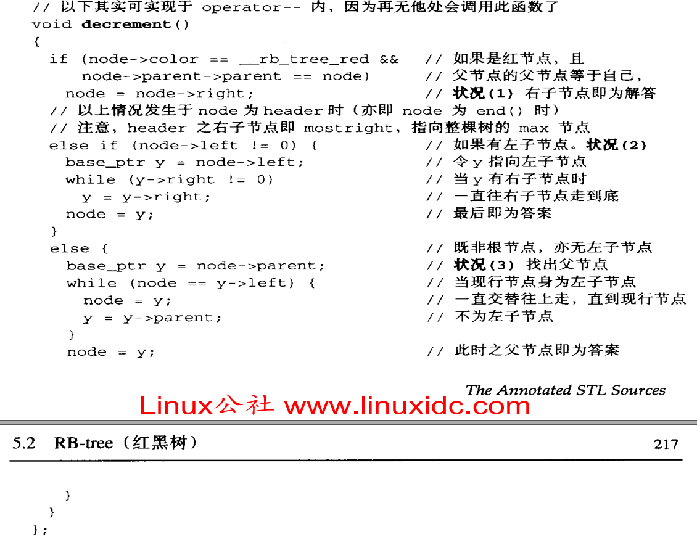

### RandomAccessIterator vs BidirectionalIterator
`RandomAccessIterator`与`BidirectionalIterator`的一个显著区别是, 迭代器`+n`, 前者时间复杂度`O(1)`, 后者时间复杂度`O(n)`, 即后则不支持随机访问<br>
https://stackoverflow.com/questions/24147609/stl-what-is-random-access-and-sequential-access<br>

### stl rb-tree
1. 实现技巧(stl源码剖析 p222):<br>

`header`节点指向`rb-tree`的`root`节点, 为红色, 且`header`与`root`互为对方的父节点<br>

2. `tree.begin()`返回最小节点(一直往左节点走)<br>

3. `tree.end()`返回`header`节点<br>

### stl rb-tree迭代器
1. 迭代器是`BidirectionalIterator`(不支持`std::sort()`, `sort()`只支持`RandomAccessIterator`, 而且`rb-tree`本身就是排序的, 不需要`std::sort()`)<br>

2. `iterator++/++iterator`的实现(stl源码剖析 p216):<br>

即二叉排序树的中序遍历(先访问左节点, 再访问右节点, 从小到大输出)<br>
```cpp
treeIter(Tree* node)
{
    if(node != nullptr)
    {
        treeIter(node->left);
        cout<<node->val;
        treeIter(node->right);
    }
}
```

3. `iterator--/--iterator`的实现(stl源码剖析 p216):<br>

即二叉排序树的中序遍历(先访问右节点, 再访问左节点, 从大到小输出)<br>
```cpp
treeIter(Tree* node)
{
    if(node != nullptr)
    {
        treeIter(node->right);
        cout<<node->val;
        treeIter(node->left);
    }
}
```

4. 借助`header`, 处理边界(如果此时迭代器指向最后一个有效节点, 执行`iterator++/++iterator`, 则能够方便的返回`header`以表示`map.end()`)<br>

5. `rb-tree`迭代器并不提供`operator+(int)`, 所以要实现`iterator+n`, 需要调用`n`次`iterator++/++iterator`<br>

### stl map为什么不用hash table而用rb-tree
1. 显然, hash table查找更快<br>

2. rb-tree提供排序功能<br>

3. unordered_map使用hash table做为底层实现算法<br>