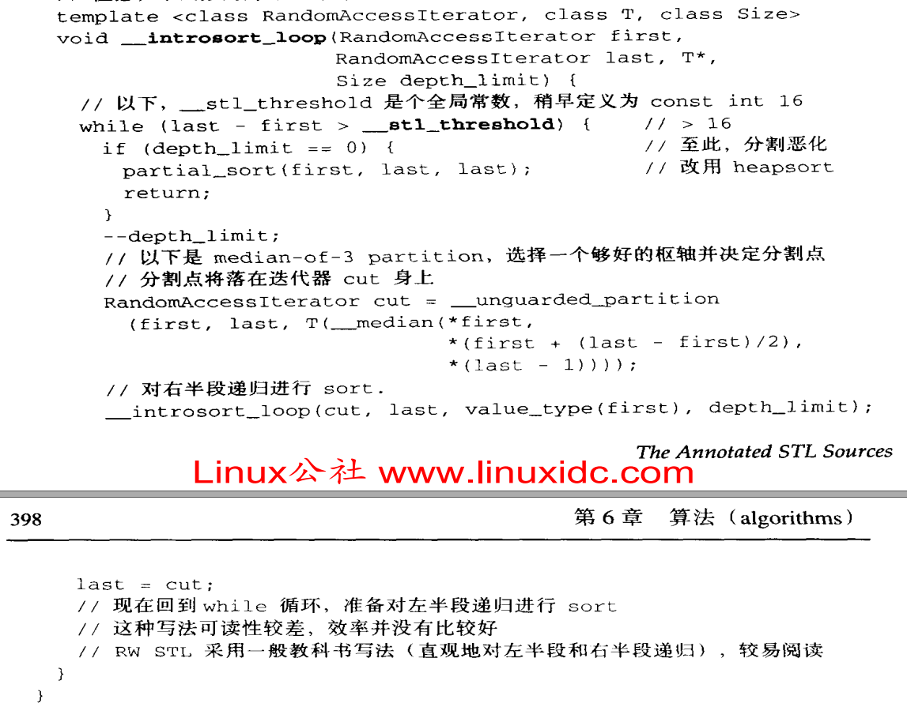
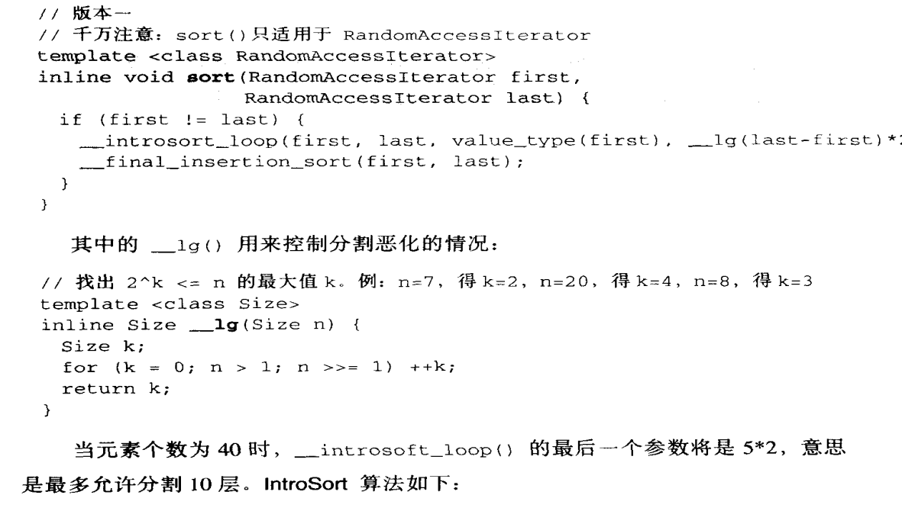
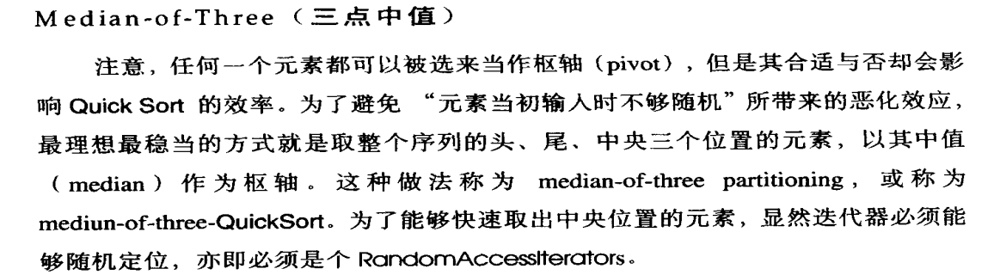

### sort()如何实现
#### <<<stl源码剖析>>> p397: 

1. 如果待排序元素小于一个预设值(16), 则调用`insert_sort()` 

2. 否则, 调用`quick_sort()` 

3. 如果`quick_sort()`过程中, 某个`partition`递归深度大于一个预设值(根据排序数目动态计算), 停止对这个`partition`的递归, 改用`heap_sort()` 

4. 如果`quick_sort()`过程中, 某个`partition`的元素数目小于一个预设值(16, 同上), 停止对这个`partition`的递归, 并保留这个`partition`未排序状态 

5. `quick_sort()`结束后, 形成了很多个`partition`, 有些`partition`已经完成排序(`heap_sort()`), 有些`partition`(元素数目<=16)未完成排序 

6. `quick_sort()`结束后, 每个`partition`之间是有序的(从小到大), 继续调用`insert_sort()`以继续完成所有排序 

### sort()实现快排的技巧与复杂度
#### <<<stl源码剖析>>> p393: 

1. `quick_sort()`平均时间复杂度`O(nlogn)`, 最坏时间复杂度`O(n^2)`, 平均空间复杂度`O(logn)` 

2. `quick_sort()`每个`partition`的平均时间复杂度`O(n)`, 如果每次`pivot`可以将`partition`数据等分, 则递归树高度为`logn` 

3. stl中`quick_sort()`使用三数中值的做法, 即取首 尾 中三个位置的中值作为某个`partition`的`pivot`, 避免递归树高度陷入`O(n)` 

### 为什么不直接用heap_sort()
1. `heap_sort()`平均时间复杂度`O(nlogn)`, 空间复杂度`O(1)` 

2. `quick_sort()`对每个`partition`进行划分时, 多次调用`pivot`, 所以`pivot`可以放在高速缓存(`cache`)中, 以加速访问 
https://blog.csdn.net/qq_36378681/article/details/102816726 

3. 由于2, 实际`quick_sort()`比`heap_sort()`更快(未验证过), 牺牲空间复杂度是可以接受的 

### 为什么要采用insert_sort()
1. 小数据量(<16)很快, 且空间复杂度`O(1)` 

2. 大数据量, `quick_sort()`之后, 每个`partition`之间有序, 部分`partition`内无序 

3. `quick_sort()`之后的`insert_sort()`, 本质上是对小数据量(<16)的排序 

4. 目前不清楚为啥`quick_sort()`之后用`insert_sort()`比较好 