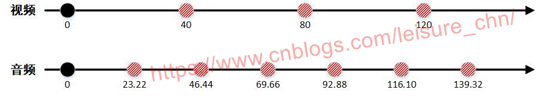

### 为什么需要同步
1. 音频渲染与视频渲染是不同的线程，都是通过定时一段时间后渲染一帧.如果没有任何其他误差干扰(如定时器不精确、代码计算延时)，理想情况下播放如下(视频25FPS 音频44.4KHz-1024个采样点/frame)：<br>


2. 非理想情况下，音频或则视频线程会因为累计误差，渐渐失去同步，如视频某一帧会比预先早或迟渲染，因此两者需要同步<br>

### 以谁为标准去同步
1. 可以选择视频时钟、音频时钟、外部时钟三种，ffplay默认选择音频时钟为同步时钟<br>

### 如何表示时钟
1. ffplay使用如下结构体定义时钟:<br>

```cpp
typedef struct Clock {
    double pts;           /* clock base */
    double pts_drift;     /* clock base minus time at which we updated the clock */
    double last_updated;
    double speed;
    int serial;           /* clock is based on a packet with this serial */
    int paused;
    int *queue_serial;
} Clock;
```

并在VideoState结构体中维护了3个时钟对象:<br>

```cpp
typedef struct VideoState {
    ...
    Clock audclk;
    Clock vidclk;
    Clock extclk;
    ...
} VideoState;
```

重点关注`Clock结构体中的pts和pts_drift`，通过查看更新`VideoState::Clock`的函数`set_clock(Clock *c, double pts, int serial)`，不难发现`pts和pts_drift`是如何设置的：<br>

```cpp
static void set_clock(Clock *c, double pts, int serial)
{
    double time = av_gettime_relative() / 1000000.0;  // 返回系统当前时间
    set_clock_at(c, pts, serial, time);
}

static void set_clock_at(Clock *c, double pts, int serial, double time)
{
    c->pts = pts;
    c->last_updated = time;
    c->pts_drift = c->pts - time;
    c->serial = serial;
}
```
其中，给`set_clock`函数传递的`pts`是`AVFrame->pts(==AVPacket->pts)`，而`pts_drift`是`AVFrame->pts(==AVPacket->pts)`与系统但前时间的差值<br>
`AVFrame->pts(==AVPacket->pts)`是解码器设置的，即解码出来一帧后得到对应的pts值<br>
`pts_drift`让`pts`与系统当前时间关联了起来<br>

### 为何选择音频时钟为同步时钟
1. 作为同步时钟，必然要有规律、准确的线性增长。而音频由声卡根据采样频率不断调用，所以满足上述要求<br>

### 如何同步
参考：<br>
https://www.cnblogs.com/leisure_chn/p/10584910.html<br>
https://www.cnblogs.com/leisure_chn/p/10307089.html<br>

针对以上两篇文章，部分点解释：<br>

1. 解释关键函数`compute_target_delay()`：<br>

```cpp
static double compute_target_delay(double delay, VideoState *is)
{
    double sync_threshold, diff = 0;

    if (get_master_sync_type(is) != AV_SYNC_VIDEO_MASTER) {
        diff = get_clock(&is->vidclk) - get_master_clock(is);   // 

        sync_threshold = FFMAX(AV_SYNC_THRESHOLD_MIN, FFMIN(AV_SYNC_THRESHOLD_MAX, delay));
        if (!isnan(diff) && fabs(diff) < is->max_frame_duration) {
            if (diff <= -sync_threshold)
                delay = FFMAX(0, delay + diff);
            else if (diff >= sync_threshold && delay > AV_SYNC_FRAMEDUP_THRESHOLD)
                delay = delay + diff;
            else if (diff >= sync_threshold)
                delay = 2 * delay;
        }
    }

    return delay;
}
```
其中，`delay`值是当前帧(未播放帧)与上一帧(已播放帧)的pts的差值, 表示理想情况下的上一帧播放后等待`delay`时间, 播放当前帧<br>
假设`delay=0.04s`, 即源视频是`25FPS`<br>
则`sync_threshold=delay=0.04s(AV_SYNC_THRESHOLD_MIN=0.04, AV_SYNC_THRESHOLD_MAX=0.1)`<br>

查看`get_clock()`函数：<br>

```cpp
static double get_clock(Clock *c)
{
    double time = av_gettime_relative() / 1000000.0;
    return c->pts_drift + time;
}
```
即 `diff = vidclk->pts_drift - audclk->pts_drift`, 即 `diff = 上一帧视频pts - 上一帧音频pts`<br>

再看`compute_target_delay()`函数内最后`diff`与`sync_threshold`的比较，表达的意识是：<br>
以`sync_threshold`为尺度，上一次播放音视频时，两则相差多少，并以`sync_threshold`为尺度设置返回的`delay`值<br>

2. 解释`video_refresh()`函数中`is->frame_timer`变量与系统当前时间`time`<br>

> A. 第一帧进入`video_refresh()`函数：<br>
在`stream_open::av_mallocz()`函数中，`is->frame_timer`会被初始化为0<br>
在`video_refresh()`函数中，有如下代码：<br>

```cpp
time = av_gettime_relative()/1000000.0;
if (delay > 0 && time - is->frame_timer > AV_SYNC_THRESHOLD_MAX)
    is->frame_timer = time;
```
即，当`is->frame_timer=0(第一帧显示)`时，`time - is->frame_timer > AV_SYNC_THRESHOLD_MAX`成立(`AV_SYNC_THRESHOLD_MAX=0.1`)，此时更新`is->frame_timer`为当前系统时间<br>
这时，`is->frame_timer`便与当前系统时间联系起来了<br>

> B. 第二帧进入`video_refresh()`函数：<br>
函数`compute_target_delay()`计算出了应该`delay`的值，`video_refresh()`函数继续根据`delay`值确定是否需要播放当前帧，此时：<br>

```cpp
time = av_gettime_relative()/1000000.0;
if (time < is->frame_timer + delay)
{
    // 继续显示上一帧
    return;
}
is->frame_timer += delay;
```
即，如果第二帧到来，需要`delay`，则不会执行`is->frame_timer += delay`, 即不会更新`is->frame_timer`的值，否则，更新`is->frame_timer`为当前帧(未显示帧)应当显示的时刻<br>


### 总结
1. 以音频时钟为参考时钟，可以认为此时钟是准确无误的，随着时间的流逝一直线性准确的增加(主要关注pts的增加)<br>

2. `diff = 上一帧视频pts - 上一帧音频pts`，因为上一帧音频pts是参考pts，则diff可以反应出上一帧视频pts落后或则超前音频pts的时间<br>

3. 根据`当前系统时间time`与`is->frame_timer+diff`的关系，决定播放上一帧、当前帧或下一帧<br>