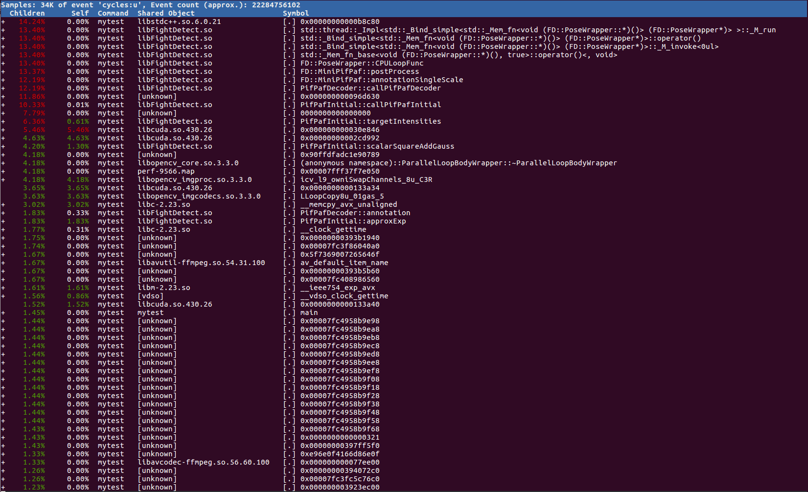
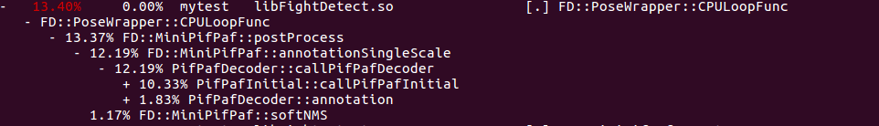
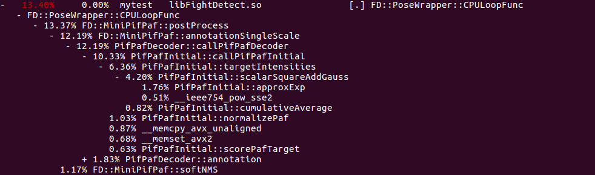

### 以一个计算人体关键点的深度学习例子为例, 计算情况是:
| 计算模块 | 预处理(如图片缩放) | CNN计算 | 后处理 |
| --- | --- | --- | --- |
| **计算平台** | CPU | GPU | CPU|
| **耗时占比** | ~5% | ~65% | ~30% |

平台:<br>
`nvidia GTX 1050Ti 4G-RAM`<br>
`intel core i5-8500@3GHz x 6`<br>
`15.6G RAM`<br>

编译:<br>
`gcc/g++ v5.4.0`<br>
`-g(开启debug) or -O2`<br>

---
### 确定耗时函数

#### 1. 使用perf record记录耗时
+ `perf record -p pid -e cycles:u -g`<br>
+ 因为这明显是一个在用户空间的CPU计算密集型任务, 因此这里使用了`cycles:u`参数, 而没有分析内核函数的占用CPU的情况<br>
+ 为了更好的显示函数占用CPU时间片的情况, 因此这里使用了`-g`参数, 启用堆栈跟踪<br>

#### 2. 使用perf report显示耗时记录


粘贴为文本如下(为了方便描述, 添加了行号):<br>
```cpp
01. +   14.24%     0.00%  mytest   libstdc++.so.6.0.21              [.] 0x00000000000b8c80
02. +   13.40%     0.00%  mytest   libFightDetect.so                [.] std::thread::_Impl<std::_Bind_simple<std::_Mem_fn<void (FD::PoseWrapper::*)()> (FD::PoseWrapper*)> >::_M_run
03. +   13.40%     0.00%  mytest   libFightDetect.so                [.] std::_Bind_simple<std::_Mem_fn<void (FD::PoseWrapper::*)()> (FD::PoseWrapper*)>::operator()
04. +   13.40%     0.00%  mytest   libFightDetect.so                [.] std::_Bind_simple<std::_Mem_fn<void (FD::PoseWrapper::*)()> (FD::PoseWrapper*)>::_M_invoke<0ul>
05. +   13.40%     0.00%  mytest   libFightDetect.so                [.] std::_Mem_fn_base<void (FD::PoseWrapper::*)(), true>::operator()<, void>
06. +   13.40%     0.00%  mytest   libFightDetect.so                [.] FD::PoseWrapper::CPULoopFunc
07. +   13.37%     0.00%  mytest   libFightDetect.so                [.] FD::MiniPifPaf::postProcess
08. +   12.19%     0.00%  mytest   libFightDetect.so                [.] FD::MiniPifPaf::annotationSingleScale
09. +   12.19%     0.00%  mytest   libFightDetect.so                [.] PifPafDecoder::callPifPafDecoder
10. +   11.86%     0.00%  mytest   [unknown]                        [.] 0x000000000096d630
11. +   10.33%     0.01%  mytest   libFightDetect.so                [.] PifPafInitial::callPifPafInitial
12. +    7.79%     0.00%  mytest   [unknown]                        [.] 0000000000000000
13. +    6.36%     0.61%  mytest   libFightDetect.so                [.] PifPafInitial::targetIntensities
14. +    5.46%     5.46%  mytest   libcuda.so.430.26                [.] 0x000000000030e846
15. +    4.63%     4.63%  mytest   libcuda.so.430.26                [.] 0x00000000002cd992
16. +    4.20%     1.30%  mytest   libFightDetect.so                [.] PifPafInitial::scalarSquareAddGauss
17. +    4.18%     0.00%  mytest   [unknown]                        [.] 0x90ffdfadc1e90789
18. +    4.18%     0.00%  mytest   libopencv_core.so.3.3.0          [.] (anonymous namespace)::ParallelLoopBodyWrapper::~ParallelLoopBodyWrapper
19. +    4.18%     0.00%  mytest   perf-9566.map                    [.] 0x00007fff37f7e050
20. +    4.18%     4.18%  mytest   libopencv_imgproc.so.3.3.0       [.] icv_l9_owniSwapChannels_8u_C3R
21.      3.65%     3.65%  mytest   libcuda.so.430.26                [.] 0x0000000000133a34
22.      3.63%     3.63%  mytest   libopencv_imgcodecs.so.3.3.0     [.] LLoopCopy8u_01gas_5
23. +    3.02%     3.02%  mytest   libc-2.23.so                     [.] __memcpy_avx_unaligned
24. +    1.83%     0.33%  mytest   libFightDetect.so                [.] PifPafDecoder::annotation
25. +    1.83%     1.83%  mytest   libFightDetect.so                [.] PifPafInitial::approxExp
26. +    1.77%     0.31%  mytest   libc-2.23.so                     [.] __clock_gettime
27. +    1.75%     0.00%  mytest   [unknown]                        [.] 0x00000000393b1940
28. +    1.74%     0.00%  mytest   [unknown]                        [.] 0x00007fc3f86040a0
29. +    1.67%     0.00%  mytest   [unknown]                        [.] 0x5f7369007265646f
30. +    1.67%     0.00%  mytest   libavutil-ffmpeg.so.54.31.100    [.] av_default_item_name
31. +    1.67%     0.00%  mytest   [unknown]                        [.] 0x00000000393b5b60
32. +    1.67%     0.00%  mytest   [unknown]                        [.] 0x00007fc408986560
33. +    1.61%     1.61%  mytest   libm-2.23.so                     [.] __ieee754_exp_avx
34. +    1.56%     0.86%  mytest   [vdso]                           [.] __vdso_clock_gettime
35.      1.52%     1.52%  mytest   libcuda.so.430.26                [.] 0x0000000000133a40
```
+ `libFightDetect.so`即为封装的整个深度学习工程的动态库, `mytest`是测试用例, 最后一列内容即为函数名(没有符号表信息的显示16进制指令地址)<br>
+ 看第1 2 3 4 5行的函数名, 都是与函数指针相关的封装, 跳过<br>

+ 看第6行, 在此工程中, 此函数是`后处理逻辑的入口函数`, 在`perf report`交互窗口展开此函数调用栈:<br>


```cpp
1. -   13.40%     0.00%  mytest   libFightDetect.so                [.] FD::PoseWrapper::CPULoopFunc
2.    - FD::PoseWrapper::CPULoopFunc
3.       - 13.37% FD::MiniPifPaf::postProcess
4.          - 12.19% FD::MiniPifPaf::annotationSingleScale
5.             - 12.19% PifPafDecoder::callPifPafDecoder
6.                + 10.33% PifPafInitial::callPifPafInitial
7.                + 1.83% PifPafDecoder::annotation
8.            1.17% FD::MiniPifPaf::softNMS
```
+ 其中, `PifPafDecoder::annotation()`和`FD::MiniPifPaf::softNMS()`函数分别占用了`1.83%`和`1.17%`的CPU采样点, 这可能是两个值得优化的函数<br>

继续展开:<br>


```cpp
1. -   13.40%     0.00%  mytest   libFightDetect.so                [.] FD::PoseWrapper::CPULoopFunc
2.    - FD::PoseWrapper::CPULoopFunc
3.       - 13.37% FD::MiniPifPaf::postProcess
4.          - 12.19% FD::MiniPifPaf::annotationSingleScale
5.             - 12.19% PifPafDecoder::callPifPafDecoder
6.                - 10.33% PifPafInitial::callPifPafInitia
7.                   - 6.36% PifPafInitial::targetIntensities
8.                      - 4.20% PifPafInitial::scalarSquareAddGauss
9.                           1.76% PifPafInitial::approxExp
10.                           0.51% __ieee754_pow_sse2
11.                        0.82% PifPafInitial::cumulativeAverage
12.                     1.03% PifPafInitial::normalizePaf
13.                     0.87% __memcpy_avx_unaligned
14.                     0.68% __memset_avx2
15.                     0.63% PifPafInitial::scorePafTarget
16.                + 1.83% PifPafDecoder::annotation
17.            1.17% FD::MiniPifPaf::softNMS
```
+ 其中, `PifPafInitial::normalizePaf()`、`__memcpy_avx_unaligned()`、`__memset_avx2()`和`PifPafInitial::scorePafTarget()`函数大概占用了`0.68%`到`1.03%`的CPU采样点, 这可能是值得优化的函数(注意, 很显然`__memcpy_avx_unaligned()`和`__memset_avx2()`两个函数是系统库函数)<br>

+ 当然, 我们最应该关注的应该是`PifPafInitial::scalarSquareAddGauss()`函数, 此函数占用了`4.20%`的CPU采样点, 如果观察最开始的`report`表, 第16行也列出了同样的CPU采样点占用率<br>

---
### 分析耗时函数

#### 1. 单纯分析perf结果无法定量分析, 这里可以通过记录目标函数占用的时间来进一步分析
+ 使用`gettimeofday()`系统库函数记录目标代码前后时间<br>
+ 耗时的确定需要使用不同的图片跑n轮循环, 计算平均耗时<br>

#### 2. 进入目标函数, 这时需要确定是否能够优化, 优化方法有:
+ 设计时间复杂度低的方法<br>
+ 设计cache友好的计算流<br>
+ 使用GPU平台计算<br>
+ 使用CPU支持的SIMD指令计算<br>

---
### 使用AVX2指令集优化耗时函数
>参考:<br>
https://software.intel.com/sites/landingpage/IntrinsicsGuide/<br>

#### 1. 查看 /proc/cpuinfo 是否支持AVX2指令集
+ 支持`AVX`指令集的CPU, 内部含有16个`256bit`的`YMM`寄存器<br>

#### 2. 编译注意点
+ cmakelists添加:<br>
```cpp
set(CMAKE_CXX_FLAGS "-std=c++11 -mavx -mfma")
```
+ 使用`-g`编译时, `_mm256_store_ps()`函数要求目的内存地址进行过`32bit`对齐<br>
>参考:<br>
https://www.sciencedirect.com/topics/computer-science/alignment-requirement<br>

使用`-O2`等优化编译时, 似乎自动进行了内存地址对齐, 若要申请进行过地址对齐的内存空间, 使用`posix_memalign()`函数<br>

#### 3. Intrinsics instructions(内联指令, 这里只列出一些注意点)
+ `_mm256_set_ps()`加载数据到`YMM`寄存器, `s`表示单精度浮点, 需要主要的是加载数据的时候, 括号`()`内的数据从左往右依次对应`YMM`寄存器的高位到低位<br>
+ 比较逻辑:<br>
```cpp
if((x > 2.f) || (x < -2.f))
{
    x = 0.f;
}
else
{
    // use x do something
}

// d0对应x   d2_0对应2.0    dn_2_0对应-2.0
tmp0 = _mm256_cmp_ps(d2_0, dx, _CMP_GT_OS);     // x > 2.f ?
tmp1 = _mm256_cmp_ps(dx, dn_2_0, _CMP_GT_OS);   // x < -2.f ?
tmp2 = _mm256_and_ps(tmp0, tmp1);               // (x > 2.f) || (x < -2.f) ?
res = _mm256_and_ps(dx, tmp2);                  // 使用此res代表比较过大小x
```
+ 因为`YMM`寄存器是`256bit`的, 因此循环可以这么写最大化利用`SIMD`寄存器(指令):
```cpp
int yy = 0;
for(yy=miny; yy+7<maxy; yy+=8)
{
    // 使用YMM寄存器的256bit
}
for(yy; yy+3<maxy; yy+=4)
{
    // 使用YMM寄存器高或低的128bit
}
for(yy; yy<maxy; yy++)
{
    // 不使用SIMD指令
}
```

---
### 结果
|  | AVX2优化前耗时 | AVX2优化后耗时 |
| --- | --- | --- |
| -g | ~4.7ms | ~3.8ms |
| -O2 | ~2.0ms | ~1.4ms |

---
### 其它
在前面分析`perf`结果时, 发现耗时的主要部分`GPU`计算没有在结果中显示出来, `perf`似乎没法很好的记录异构计算的真实情况