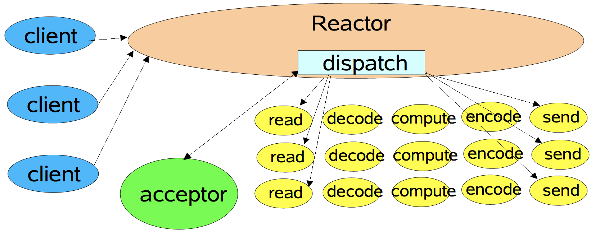

### Reactor模型
>主要内容参考下面的网址(总结得非常好):<br>
https://www.cnblogs.com/winner-0715/p/8733787.html<br>

1. `Reactor`模型基于同步非阻塞`IO`和`IO`多路复用<br>

2. 单线程`Reactor`模式<br>


数据`IO`读写与业务逻辑操作都在一个线程上<br>

3. 工作者线程池`Reactor`模式<br>


数据`IO`读写在一个线程上，业务逻辑操作分发到工作线程池上<br>

4. 多`Reactor`线程模式<br>


客户端连接请求处理(`accept`)在主`Reactor(mainReactor)`线程上，与每个客户端具体的数据IO读写与业务逻辑操作都分配到了子`Reactor(subReactor)`线程池上<br>

---
### muduo库网络IO模型
>以 `muduo/example/asio/chat/server_threaded_highperformance.cc` 代码逻辑为例, 代码做了简化处理<br>

1. `main()`函数<br>
```cpp
// server_threaded_highperformance.cc
void main()
{
    // ...
    EventLoop loop;               // 实例化一个Reactor模型(这里可以看作mainReactor)
    ChatServer server(&loop, InetAddress(port));       // 实例化server
    server.setThreadNum(n);       // 设置线程数
    server.start();               // 启动server
    loop.loop();                  // 启动事件循环(这里是mainReactor)
    // ...
}
```
查看`ChatServer`类的定义, 主要关注该类的成员变量`TcpServer server_`<br>
A. 追踪`server.setThreadNum()`看到:<br>
```cpp
// TcpServer.cc
void TcpServer::setThreadNum(int numThreads)
{
  assert(0 <= numThreads);
  threadPool_->setThreadNum(numThreads);
}
//        ||
//        ||
//        VV
// EventLoopThreadPool.h
void setThreadNum(int numThreads)
{
    numThreads_ = numThreads;
}
```
B. 追踪`server.start()`看到:<br>
```cpp
// server_threaded_highperformance.cc
void start()
{
    server_.start();
}
//        ||
//        ||
//        VV
// TcpServer.cc
void TcpServer::start()
{
  if (started_.getAndSet(1) == 0)
  {
    threadPool_->start(threadInitCallback_);     // 启动线程池
    assert(!acceptor_->listenning());            // 启动server监听
    loop_->runInLoop(std::bind(&Acceptor::listen, get_pointer(acceptor_)));     // 给loop_(这里是mainReactor)注册一个任务
  }
}
```
`threadPool_->start()`和`loop_->runInLoop()`函数在后面进行分析<br>

C. `loop.loop()`启动`EventLoop`(`mainReactor`事件循环), 具体在后面进行分析<br>


2. `threadPool_->start()`函数<br>

A. 跟踪`threadPool_->start()`函数：<br>
```cpp
// EventLoopThreadPool.cc
void EventLoopThreadPool::start(const ThreadInitCallback& cb)
{
    assert(!started_);
    baseLoop_->assertInLoopThread();
    started_ = true;
    for (int i = 0; i < numThreads_; ++i)
    {
        EventLoopThread* t = new EventLoopThread(cb, buf);                // 使用`EventLoopThread`封装一个线程和对应的event_loop
        threads_.push_back(std::unique_ptr<EventLoopThread>(t));          // 保存`EventLoopThread`线程对象
        loops_.push_back(t->startLoop());                                 // 保存`EventLoopThread`线程启动后返回的event_loop(这里时subReactor)
    }
    if (numThreads_ == 0 && cb)
    {
        cb(baseLoop_);
    }
}
```
在此函数中, 会`new` `numThreads_`个`EventLoopThread`对象, 然后保存在`threads_`数组里<br>

B. `t->startLoop()`启动线程, 并将返回的`EventLoop`对象保存在`loops_`数组里：<br>
```cpp
// EventLoopThread.cc
EventLoop* EventLoopThread::startLoop()
{
  assert(!thread_.started());
  thread_.start();                // 启动一个线程
  EventLoop* loop = NULL;
  {
    MutexLockGuard lock(mutex_);
    while (loop_ == NULL)
    {
      cond_.wait();               // 阻塞直到被唤醒和 loop_ != NULL
    }
    loop = loop_;                 // 赋值
  }
  return loop;                    // 返回EventLoop
}
```
跟踪`thread_.start()`:<br>
```cpp
// Thread.cc
void Thread::start()
{
  assert(!started_);
  started_ = true;
  detail::ThreadData* data = new detail::ThreadData(func_, name_, &tid_, &latch_);
  pthread_create(&pthreadId_, NULL, &detail::startThread, data);   // 创建子线程
  latch_.wait();   // 主线程阻塞
}
```
系统调用`pthread_create()`会新建一个子线程, 这时主线程阻塞在`latch_.wait();`, 看子线程：<br>
```cpp
// Thread.cc
void* startThread(void* obj)
{
  ThreadData* data = static_cast<ThreadData*>(obj);
  data->runInThread();  // 继续往下看
  delete data;
  return NULL;
}
//        ||
//        ||
//        VV
void runInThread()
{
    // ...
    latch_->countDown();   // 会唤醒阻塞到`latch_.wait()`的主线程
    func_();               // 执行`EventLoopThread::threadFunc`
    // ...
}
```
唤醒主线程, 执行主线程初始化时传进来的函数`EventLoopThread::threadFunc`:<br>
```cpp
// EventLoopThread.cc
void EventLoopThread::threadFunc()
{
  EventLoop loop;      // 新建一个EventLoop对象
  {
    MutexLockGuard lock(mutex_);
    loop_ = &loop;     // 给loop_指针赋值
    cond_.notify();    // 唤醒一个阻塞中的线程通知loop_指针有效了
  }
  loop.loop();         // 启动事件循环
  MutexLockGuard lock(mutex_);
  loop_ = NULL;        // 清空loop_
}
```

此时, `threadPool_->start()`函数便执行完毕了, 新启动的线程都在进行`loop()`循环, 主线程将得到子线程的`EventLoop`对象<br>

3. `loop_->runInLoop()`函数<br>

A. 此`loop_`指向`main()`函数新建的`EventLoop`对象<br>

B. 跟踪`runInLoop()`函数：<br>
```cpp
// TcpServer.cc
void TcpServer::start()
{
    // ...
    loop_->runInLoop(std::bind(&Acceptor::listen, get_pointer(acceptor_)));
    // ...
}
//        ||
//        ||
//        VV
// EventLoop.cc
void EventLoop::runInLoop(Functor cb)
{
  // 如果loop所属线程与调用EventLoop::runInLoop函数的线程是同一个, 则直接调用
  if(isInLoopThread()) cb();
  // 如果loop所属线程与调用EventLoop::runInLoop函数的线程不是同一个, 则先将任务添加到队列中
  else queueInLoop(std::move(cb));
}
```
因为`loop_`所属线程与调用`EventLoop::runInLoop`函数的线程是同一个, 因此直接执行回调<br>
```cpp
// Acceptor.cc
void Acceptor::listen()
{
  acceptSocket_.listen();           // 启动对listen fd的监听
  acceptChannel_.enableReading();   // 将listen fd关注的读有效事件和listen fd本身注册到epoll
}
```
实际上注册到`epoll`的代码实现是:<br>
```cpp
// Acceptor.cc
void enableReading() { events_ |= kReadEvent; update(); }
//        ||
//        ||
//        VV
// Channel.cc
void Channel::update()
{
  loop_->updateChannel(this);
}
//        ||
//        ||
//        VV
// EventLoop.cc
void EventLoop::updateChannel(Channel* channel)
{
  poller_->updateChannel(channel);
}
//        ||
//        ||
//        VV
// EPollPoller.cc
void EPollPoller::updateChannel(Channel* channel)
{
    update(EPOLL_CTL_ADD, channel);
}
//        ||
//        ||
//        VV
// EPollPoller.cc
void EPollPoller::update(int operation, Channel* channel)
{
    ::epoll_ctl(epollfd_, operation, fd, &event);
}
```

4. `loop.loop()`函数, 当有新连接进来触发可读事件时<br>

A. 主要执行以下逻辑:<br>
```cpp
// EventLoop.cc
void EventLoop::loop()
{
    pollReturnTime_ = poller_->poll(kPollTimeMs, &activeChannels_);  // 系统调用epoll_wait()
    for (Channel* channel : activeChannels_)
    {
      currentActiveChannel_ = channel;
      currentActiveChannel_->handleEvent(pollReturnTime_);           // 由channel执行回调
    }
    doPendingFunctors();                                             // 处理任务队列里的任务
}
```

B. `poller_->poll()`函数：<br>
```cpp
// EventLoop.cc
Timestamp EPollPoller::poll(int timeoutMs, ChannelList* activeChannels)
{
    int numEvents = ::epoll_wait(epollfd_,
                               &*events_.begin(),
                               static_cast<int>(events_.size()),
                               timeoutMs);
}
```
注意`timeoutMs`超时时间，在`EventLoop.cc`中定义为:<br>
```cpp
// EventLoop.cc
const int kPollTimeMs = 10000;
```
即每`10S`跑一次循环(如果没有事件触发的话)<br>

C. `currentActiveChannel_->handleEvent(pollReturnTime_)`:<br>
```cpp
// Channel.cc
void Channel::handleEvent(Timestamp receiveTime)
{
    handleEventWithGuard(receiveTime);
}
//        ||
//        ||
//        VV
// Channel.cc
void Channel::handleEventWithGuard(Timestamp receiveTime)
{
    if (revents_ & (POLLIN | POLLPRI | POLLRDHUP))
    {
        if (readCallback_) readCallback_(receiveTime);   // 读事件回调
    }
    if (revents_ & POLLOUT)
    {
        if (writeCallback_) writeCallback_();            // 写事件回调
    }
}
```

D. 让我们看看本例程中向`channel`对象注册的读事件回调:<br>
```cpp
// Acceptor.cc
Acceptor::Acceptor(...)   // Acceptor类构造函数
{
    acceptChannel_.setReadCallback(std::bind(&Acceptor::handleRead, this));
}
//        ||
//        ||
//        VV
// Channel.h
void setReadCallback(ReadEventCallback cb)
{
    readCallback_ = std::move(cb);
}
```

E. 接着执行`readCallback_()`回调:<br>
```cpp
// Acceptor.cc
void Acceptor::handleRead()
{
    int connfd = acceptSocket_.accept();
    if (connfd >= 0)
    {
        newConnectionCallback_(connfd, peerAddr);
    }
}
```

F. 看看本例程中向`Acceptor`对象注册的新客户端连接回调:<br>
```cpp
// TcpServer.cc
TcpServer::TcpServer(...)   // TcpServer构造函数
{
    acceptor_->setNewConnectionCallback(std::bind(&TcpServer::newConnection, this, _1, _2));
}
//        ||
//        ||
//        VV
// Acceptor.h
void setNewConnectionCallback(const NewConnectionCallback& cb)
{
    newConnectionCallback_ = cb;
}
```

G. 接着执行`newConnectionCallback_()`回调:<br>
```cpp
// TcpServer.cc
void TcpServer::newConnection(int sockfd, const InetAddress& peerAddr)
{
    loop_->assertInLoopThread();
    EventLoop* ioLoop = threadPool_->getNextLoop();            // 从EventLoop线程池(subReactor)中取出一个ioLoop(此EventLoop对象属于一个子线程)
    InetAddress localAddr(sockets::getLocalAddr(sockfd));
    // 新建一个TcpConnection对象
    TcpConnectionPtr conn(new TcpConnection(ioLoop,            // 将ioLoop(subReactor)传递给TcpConnection对象
                                            connName,
                                            sockfd,
                                            localAddr,
                                            peerAddr));
    connections_[connName] = conn;                             // 将此TcpConnection对象记录到hash表
    conn->setConnectionCallback(connectionCallback_);
    conn->setMessageCallback(messageCallback_);
    conn->setWriteCompleteCallback(writeCompleteCallback_);
    conn->setCloseCallback(
        std::bind(&TcpServer::removeConnection, this, _1));
    ioLoop->runInLoop(std::bind(&TcpConnection::connectEstablished, conn));   // 查看3-B节
}
```
此函数非常关键, `mainReactor`监听到新连接请求, 调用此回调函数. 回调函数会新建一个`TcpConnection`对象, 并将一个属于线程池中某个线程的`ioLoop(subReactor)`对象传递给它, 然后设置回调, 最后调用`ioLoop->runInLoop()`函数<br>

查看`threadPool_->getNextLoop()`函数：<br>
```cpp
// EventLoopThreadPool.cc
EventLoop* EventLoopThreadPool::getNextLoop()
{
    EventLoop* loop = baseLoop_;    // 如果ioLoop(subReactor)线程池为空, 将返回mainReactor
    if (!loops_.empty())
    {
        // round-robin
        loop = loops_[next_];       // 轮询调度
        ++next_;
        if (implicit_cast<size_t>(next_) >= loops_.size())
        {
            next_ = 0;
        }
    }
    return loop;
}
```

根据`3-B节`对`ioLoop->runInLoop()`函数的描述, 此时`ioloop`所属线程(子线程, `subReactor`)与调用`EventLoop::runInLoop`函数的线程(主线程, `mainReactor`)不是同一个, 则先将任务添加到队列中<br>

5. `loop.loop()`函数, 当有已连接的客户端向服务器发送消息触发可读事件时(注意, 这里时在`ioLoop(subReactor)`所属线程上触发, 已经不是在主线程(`mainReactor`)上触发)<br>
类似第4节描述的, 这里直接给出回调路径：<br>
```cpp
// TcpConnection.cc
void TcpConnection::handleRead(Timestamp receiveTime)
{
    ssize_t n = inputBuffer_.readFd(channel_->fd(), &savedErrno);
    messageCallback_(shared_from_this(), &inputBuffer_, receiveTime);
}
//        ||
//        ||
//        VV
// TcpServer.cc
void TcpServer::newConnection(int sockfd, const InetAddress& peerAddr)
{
    conn->setMessageCallback(messageCallback_);
}
//        ||
//        ||
//        VV
// server_threaded_highperformance.cc
ChatServer(...)   // ChatServer构造函数
{
    LengthHeaderCodec codec_;
    server_.setMessageCallback(std::bind(&LengthHeaderCodec::onMessage, &codec_, _1, _2, _3));
}
//        ||
//        ||
//        VV
// codec.h
void onMessage(...)
{
    messageCallback_(conn, message, receiveTime);
}
//        ||
//        ||
//        VV
// server_threaded_highperformance.cc
void onStringMessage(...)
{
    EventLoop::Functor f = std::bind(&ChatServer::distributeMessage, this, message);
    loops_->queueInLoop(f);
}
```
`loops_->queueInLoop(f)`函数在后面进行分析<br>
查看继续要执行的`ChatServer::distributeMessage()`函数：<br>
```cpp
// server_threaded_highperformance.cc
void distributeMessage(const string& message)
{
    codec_.send(get_pointer(*it), message);
}
//        ||
//        ||
//        VV
// codec.h
void send(...)
{
    conn->send(&buf);   // TcpConnection* conn
}
```
`conn->send(&buf)`函数在后面进行分析<br>

查看整个过程, 可以看到数据读写(写在下一节进行分析)与业务逻辑处理都在`ioLoop(subReactor)`上进行<br>

6. 写数据<br>
A. 查看`loops_->queueInLoop(f);`函数：<br>
```cpp
// EventLoop.cc
void EventLoop::queueInLoop(Functor cb)
{
    {
        MutexLockGuard lock(mutex_);
        pendingFunctors_.push_back(std::move(cb));    // 添加任务队列
    }
    // 如果loop所属线程与调用queueInLoop()线程不是同一个, 则激活epoll_wait, 以立即执行任务队列的任务
    if (!isInLoopThread() || callingPendingFunctors_)
    {
        wakeup();
    }
}
```
查看`wakeup()`函数：<br>
```cpp
// EventLoop.cc
void EventLoop::wakeup()
{
  uint64_t one = 1;
  ssize_t n = sockets::write(wakeupFd_, &one, sizeof one);  // 向wakeupFd_写入数据以激活epoll_wait
}
```
可以看到激活`epoll_wait`是很巧妙的, 使用一个`wakeupFd_`文件描述符专门用来让其它线程激活这个线程的`epoll_wait`<br>

B. 查看`conn->send(&buf)`函数:<br>
```cpp
// TcpConnection.cc
void TcpConnection::send(Buffer* buf)
{
    if (loop_->isInLoopThread())   // loop所属线程与调用send()函数同一个线程, 直接发送数据
    {
        sendInLoop(buf->peek(), buf->readableBytes());
        buf->retrieveAll();
    }
    else          // 否则, 添加到任务队列
    {
        void (TcpConnection::*fp)(const StringPiece& message) = &TcpConnection::sendInLoop;
        loop_->runInLoop(std::bind(fp, this, buf->retrieveAllAsString()));
    }
}
```
查看`sendInLoop(buf->peek(), buf->readableBytes())`函数：<br>
```cpp
// TcpConnection.cc
void TcpConnection::sendInLoop(const void* data, size_t len)
{
    nwrote = sockets::write(channel_->fd(), data, len);        // 往socket写数据
    remaining = len - nwrote;                                  // 还剩下多少没写完
    if (remaining == 0 && writeCompleteCallback_)              // 如果写完了, 触发回调
    {
        loop_->queueInLoop(std::bind(writeCompleteCallback_, shared_from_this()));
    }
    if (!faultError && remaining > 0)                          // 如果没写完
    {
        outputBuffer_.append(static_cast<const char*>(data)+nwrote, remaining);   // 未发送完的数据添加到outputBuffer_
        if (!channel_->isWriting())
        {
            channel_->enableWriting();              // 向epoll fd注册可写事件, 以及时写入剩下的数据
        }
    }
}
```
查看`outputBuffer_.append()`函数：<br>
```cpp
// Buffer.h
void append(const char* /*restrict*/ data, size_t len)
{
    ensureWritableBytes(len);                        // 确保buf空间足够
    std::copy(data, data+len, beginWrite());         // 拷贝数据到buf中
    hasWritten(len);                                 // check
}
```
即将未写完的数据拷贝到`buf`中<br>
查看`outputBuffer_.append()`函数：<br>
```cpp
// Buffer.h
void ensureWritableBytes(size_t len)
{
    if(writableBytes() < len)                        // 如果空间不够
    {
        makeSpace(len);                              // 扩容
    }
    assert(writableBytes() >= len);
}
```
查看`makeSpace()`函数：<br>
```cpp
// Buffer.h
void makeSpace(size_t len)
{
    if (writableBytes() + prependableBytes() < len + kCheapPrepend)
    {
        buffer_.resize(writerIndex_+len);
    }
    else
    {
        // move readable data to the front, make space inside buffer
        assert(kCheapPrepend < readerIndex_);
        size_t readable = readableBytes();
        std::copy(begin()+readerIndex_,
                begin()+writerIndex_,
                begin()+kCheapPrepend);
        readerIndex_ = kCheapPrepend;
        writerIndex_ = readerIndex_ + readable;
        assert(readable == readableBytes());
    }
}
```
即主要对`std::vector<char> buffer_;`对象进行扩容<br>

可以看到, 用户写入数据时, 如果此时`IO`繁忙, `muduo`库会将不能及时发送的数据缓存, 并向`epoll_wait`注册可写事件已发送完所有数据<br>

---
### muduo库网络IO模型总结
1. 整体架构同多`Reactor`线程模式(没有工作者线程池)<br>

2. 封装<br>
A. 文件描述符(`fd`)和关注的事件(`event`)以及读写等回调由`channel`类进行封装<br>
B. `IO`多路复用(`epoll_fd`)和围绕由IO多路复用管理的事件循环等由`EventLoop`类进行封装<br>
C. `server`的实现包含了`Acceptor`类和`TcpConnection`类, `Acceptor`类封装了客户端连接建立的回调等功能<br>
D. `client`由`TcpConnection`类实现<br>

3. 用户在业务层发送数据, 当网络`IO`繁忙时, `muduo`库会缓存数据, 此时多了一次用户空间的数据拷贝, 反之不繁忙时, 直接发送, 无需用户空间的数据拷贝<br>