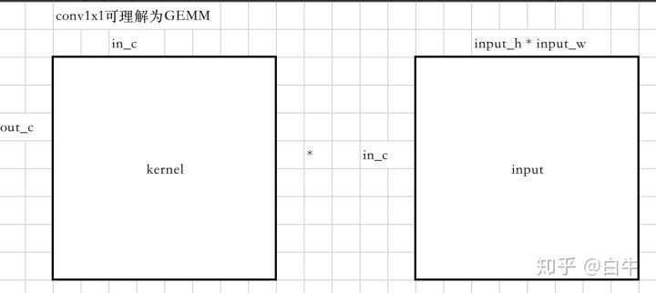

目录---<br>
--------- 一 矩阵乘法与sGEMM<br>
--------- 二 对kernel矩阵重排(在ncnn中以aarch64为例)<br>
--------- 三 为什么这样重排<br>
--------- 四 与how-to-optimize-gemm教程的区别<br>

参考：<br>
https://zhuanlan.zhihu.com/p/81201840<br>
https://zhuanlan.zhihu.com/p/65436463<br>


### 一 矩阵乘法与sGEMM<br>

1. 设有`C[m, n] = A[m, k]*B[k, n]`矩阵乘法, 则一次矩阵乘法的计算量为`m*n*k`次乘累加<br>

2. 矩阵乘法本身的计算量在sGEMM中是不变的, 对于sGEMM的优化主要是对`cache`缓存的优化<br>

3. 对于卷积计算, 以`conv1x1s1`为例, 可以将`conv1x1s1`转化为一个sGEMM, 其中：<br>
    `k = input_channel`<br>
    `m = output_channel`<br>
    `n = input_h*input_w`<br>

即`kernel`可以看作`m*k`的A矩阵, 输入`heatmap`可以看作`k*n`的B矩阵, 输出为`m*n`的C矩阵<br>




### 二 对kernel矩阵重排(在ncnn中以aarch64为例)<br>

1. 对`A(kernel)`矩阵重排, 对应`ncnn-convolution_1x1.h`中的`conv1x1s1_sgemm_transform_kernel_neon`函数<br>


对应代码解释如下：<br>
```cpp
kernel_tm.create(4*8, inch/4 + inch%4, outch/8 + (outch%8)/4 + outch%4);
// 遍历行, 步长为8, 遍历完成后生成outch/8个channel
for (; p+7<outch; p+=8)
{
    // 指向每一行的起始位置
    const float* kernel0 = kernel + (p+0)*inch;
    const float* kernel1 = kernel + (p+1)*inch;
    const float* kernel2 = kernel + (p+2)*inch;
    const float* kernel3 = kernel + (p+3)*inch;
    const float* kernel4 = kernel + (p+4)*inch;
    const float* kernel5 = kernel + (p+5)*inch;
    const float* kernel6 = kernel + (p+6)*inch;
    const float* kernel7 = kernel + (p+7)*inch;

    // ktmp每次指向新的channle
    float* ktmp = kernel_tm.channel(p/8);

    // 遍历列, 步长为1, 遍历完成后生成inch/4行
    // for循环完成后，生成一个数据重排后的channel
    for (int q=0; q<inch; q++)
    {
        // 将一列的8个元素排成一行
        ktmp[0] = kernel0[0];
        ktmp[1] = kernel1[0];
        ktmp[2] = kernel2[0];
        ktmp[3] = kernel3[0];
        ktmp[4] = kernel4[0];
        ktmp[5] = kernel5[0];
        ktmp[6] = kernel6[0];
        ktmp[7] = kernel7[0];

        ktmp += 8;
        kernel0 += 1;
        kernel1 += 1;
        kernel2 += 1;
        kernel3 += 1;
        kernel4 += 1;
        kernel5 += 1;
        kernel6 += 1;
        kernel7 += 1;
    }
}
```

2. 对B(输入`heatmap`)矩阵重排, 对应`ncnn-convolution_1x1.h`中的`conv1x1s1_sgemm_neon`函数的矩阵重排部分<br>


对应代码解释如下：<br>
```cpp
const int size = w * h;
Mat tmp(8*4, inch/4+inch%4, size/8 + (size%8)/4 + size%4, 4u, opt.workspace_allocator);
// 遍历列, 步长为8, 遍历完成后生成(h*w)/8个channel
for (int ii=0; ii<nn_size; ii++)
{
    int i = ii * 8;

    const float* img0 = bottom_blob.channel(0);
    // img0每次指向新的列(步长为8)
    img0 += i;

    float* tmpptr = tmp.channel(i/8);

    // 遍历行, 步长为1, 遍历完成后生成inch/4行
    // for循环完成后，生成一个数据重排后的channel
    for (int q=0; q<inch; q++)
    {
        // 将一行的8个元素继续排成一行
        tmpptr[0] = img0[0];
        tmpptr[1] = img0[1];
        tmpptr[2] = img0[2];
        tmpptr[3] = img0[3];
        tmpptr[4] = img0[4];
        tmpptr[5] = img0[5];
        tmpptr[6] = img0[6];
        tmpptr[7] = img0[7];

        tmpptr += 8;
        // 每次循环img0指向新的一行
        img0 += bottom_blob.cstep;
    }
}
```

### 三 为什么这样重排<br>

参看`ncnn-convolution_1x1.h`中的`conv1x1s1_sgemm_neon`函数中的矩阵乘法部分，简写为如下三个循环：<br>
```cpp
for i in 0...out_c: step=8
    for j in 0...size: step=8
        for k in 0...in_c: step=4
            out[8x8]=A[8x4]*B[4x8]
```

1. 最内层循环<br>
    for循环计算完成后，得到`out`矩阵的一个`[8x8]`小块矩阵结果<br>
    `8x4/4x8`对应重排后的`kernel`以及输入`heatmap`矩阵的一行元素<br>
    对表达式`out[8x8]=A[8x4]*B[4x8]`做展开，就会得到ncnn函数中汇编计算部分<br>

    计算时：<br>
    A.一次取`kernel`矩阵一列中挨着的8个元素乘以输入`heatmap`矩阵第2行中挨着的8个元素(注意不是常规的乘法)<br>
    B.取`kernel`矩阵第2列中挨着的8个元素乘以输入`heatmap`矩阵第2行中挨着的8个元素，累加到A的结果中<br>
    C.重复直到第4列和第4行，乘累加完成后得到`out[8x8]`<br>
    D.以上是一次最内层for循环的计算，第2次最内层for循环会重复以上`A B C`三个步骤，只不过操作的数据不一样<br>

    观察以上计算, 所有用到的kernel小矩阵块shape为[8xsize], 所有用到的输入heatmap小矩阵块shape为[8xsize], 

2. 中间for循环<br>
    循环一次得到`out`矩阵的一个`[8x8]`小块矩阵结果，下一次得到第2个`[8x8]`小块矩阵结果<br>
    计算完成后，得到`out`矩阵`[8xsize]`块矩阵的结果<br>

3. 最外层for循环<br>
    循环一次得到`out`矩阵`[8xsize]`块矩阵的结果，下一次得到第2个`[8xsize]`块矩阵的结果<br>
    计算完成后，所有计算都完成了<br>

总结，`out`矩阵计算的方式决定了对`kernel`矩阵和输入`heatmap`矩阵的重排方式<br>


### 四 与how-to-optimize-gemm教程的区别<br>

1. 在教程中有对输入矩阵`A B`的划分，即划分出`[mc, kc]`和`[kc, nc]`的子矩阵，划分大小取决于`cache`的大小，然后对子矩阵做重排，然后计算，计算完成后再做下一次划分<br>

2. ncnn在初始化时先对整个A矩阵做重排，然后在运行时对整个B矩阵做重排，不划分子矩阵。ncnn中的3个for循环以及计算类似教程中的`kernel_4x4`单个函数，而没有教程中切分子矩阵的3个for循环<br>