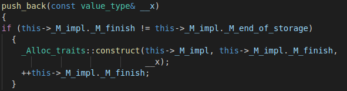
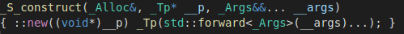
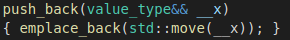

### 一 new运算符与::operator new

ref:<br>
https://www.cnblogs.com/raichen/p/5808766.html<br>
http://www.cplusplus.com/reference/new/operator%20new/<br>

1. 区分运算符与函数<br>
A. 一般当我们写下`new`时, 是指c++编译器里的`new`运算符, 同`+ - * / =`等一样都是`new`运算符<br>
B. 当我们写下`::operator new`时, 是指内置的函数, 不是一个运算符, 同`::operator+ ::operator=`等一样都是内置的函数<br>

2. 联系`new`运算符与`new`函数<br>
当我们写下`new`时, 比如`Base* obj = new Base;`, 可以看作编译器将`new`运算符展开如下:<br>

```cpp
// Base* obj = new Base;
Base* temp = (Base*) ::operator new(sizeof(Base));    // 1. 分配内存
::new(temp) Base;    // 2. 调用::operator new的第三个版本---placement new, 接着调用构造函数
Base* obj = temp;    // 3. 返回对象指针
```

即, `new`运算符通过调用`::operator new`完成功能<br>

3. `placement new`似乎没做任何工作, 既没有分配内存, 也没有调用构造函数等的操作, 根据手册只是将传入的指针返回, 那为什么会有这么一个版本呢:<br>
因为第1步已经分配了内存, 为了只调用类的构造函数, 我们不能写下`new Base;`或则类似第1步的语句, 因为这样又会重新分配内存<br>


### 二 类的产生与消亡

1. 产生, 先分配空间, 再调用类的构造函数(`non-trival`)<br>

2. 消亡, 先调用类的析构函数(`non-trival`), 再回收空间<br>

### 三 c++11 ::operator new

ref:
http://www.cplusplus.com/reference/new/operator%20new/<br>

1. `void* operator new (std::size_t size)` 失败时抛出`bad_alloc`异常, 注意不会返回`nullptr`<br>

2. `void* operator new (std::size_t size, const std::nothrow_t& nothrow_value) noexcept`, 失败时不会抛出`bad_alloc`异常, 但会返回`nullptr`<br>

3. `void* operator new (std::size_t size, void* ptr) noexcept`, 即`placement new`, 需要第二个参数`void* ptr`, 返回ptr, 不做其他任何工作<br>

4. 例子:<br>
```cpp
// operator new example
#include <iostream>     // std::cout
#include <new>          // ::operator new

struct MyClass {
  int data[100];
  MyClass() {std::cout << "constructed [" << this << "]\n";}
};

int main () {

  std::cout << "1: ";
  MyClass * p1 = new MyClass;
      // allocates memory by calling: operator new (sizeof(MyClass))
      // and then constructs an object at the newly allocated space

  std::cout << "2: ";
  MyClass * p2 = new (std::nothrow) MyClass;
      // allocates memory by calling: operator new (sizeof(MyClass),std::nothrow)
      // and then constructs an object at the newly allocated space

  std::cout << "3: ";
  new (p2) MyClass;
      // does not allocate memory -- calls: operator new (sizeof(MyClass),p2)
      // but constructs an object at p2

  // Notice though that calling this function directly does not construct an object:
  std::cout << "4: ";
  MyClass * p3 = (MyClass*) ::operator new (sizeof(MyClass));
      // allocates memory by calling: operator new (sizeof(MyClass))
      // but does not call MyClass's constructor

  delete p1;
  delete p2;
  delete p3;

  return 0;
}
```

### 四 c++11 ::operator delete

ref:<br>
http://www.cplusplus.com/reference/new/operator%20delete/<br>

1. 当我们平常写下`delete MyClass`的时候, 实际上编译器会隐式的转化为先调用`MyClass`的析构函数(`non-trival`), 然后调用`::operator delete(MyClass)`<br>

2. 如果只想释放掉内存, 而不调用`MyClass`的析构函数, 则`delete((void*)MyClass)`, 即将类对象转换为`void*`类型, `g++`编译器会产生警告, 但是可以运行<br>


### 五 自定义类重载::operator new

注意是重载`::operator new`函数, 而不是`new`运算符, 同样重载`::operator+ ::operator=`等都不是重载`+ =`运算符, 而是重载函数<br>

当类内重载了`::operator new`函数, 写下`Base* obj = new Base;`时, 第1步将调用类内的重载`new`版本, 而不再调用全局`::operator new`版本<br>


### 六 std::vector::push_back()方法

1. 如果插入一个左值对象<br>

```cpp
Base obj;
std::vector<Base> vec;
vec.push_back(obj);
```

跟踪源代码(F12), 可以看到:<br>


此时`push_back`采用左值接收<br>

同时:<br>


即`::new((Base*)ptr) Base(obj)`, 在已分配的内存指针`ptr`上, 调用`placement new`, 接着调用拷贝构造函数完成对象构造<br>


2. 如果插入一个右值对象<br>

```cpp
std::vector<Base> vec;
vec.push_back(Base());
```

跟踪源代码(F12), 可以看到:<br>


此时`push_back`采用右值接收, 并调用`emplace_back()`版本<br>

继续跟踪源代码, 可以同样看到:<br>


似乎跟左值版本相同<br>
但注意到`std::forward<_Args>(__args)...)`, 即根据`args`的左右值属性调用相应的构造函数, 如果类实现了移动拷贝构造函数, 则会优先调用它而不是拷贝构造<br>
如果类没有实现移动拷贝构造函数呢? 则必须将拷贝构造的参数写成`const Base&`类型, 因为`const`引用可以接收左右值<br>


### 七 移动构造与拷贝构造
1. `std::vector::push_back()`方法插入左值与右值最终实现的方法都是一样的, 只是会分别去调用类的左右值不同版本的构造方法<br>

2. 为何经常看到移动构造函数比拷贝构造函数快的说法:<br>
实际上如果类内都是栈对象, 则没有区别<br>
如果类内有指针, 则移动构造函数将`vector`内对象内的指针指向零时对象内指针所指区域显然比拷贝构造函数大片复制内存要快<br>