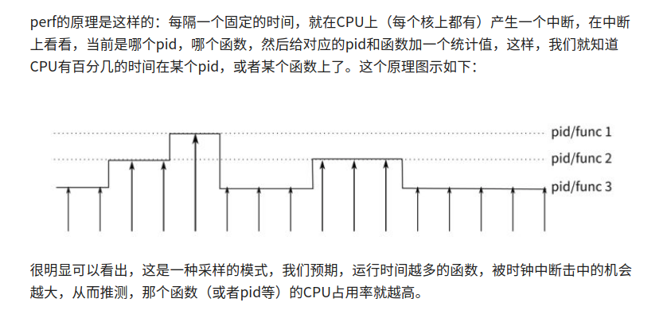
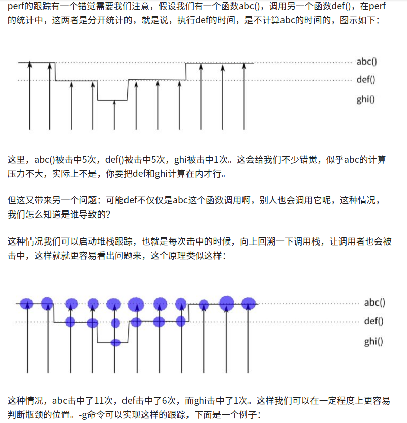
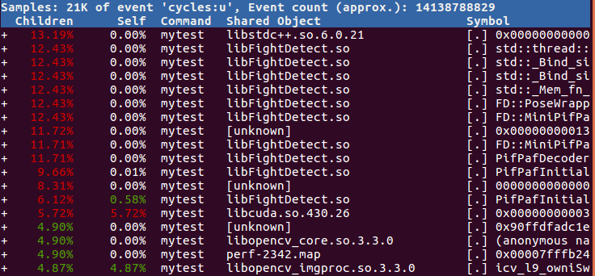

### 安装
>参考: 
https://askubuntu.com/questions/50145/how-to-install-perf-monitoring-tool/306683 
https://kifarunix.com/installing-perf-performance-analysis-tool-on-ubuntu-18-04/ 

1. `sudo apt install linux-tools-$(uname -r) linux-tools-generic` 

2. 安装与当前系统内核相关的版本, 因此加上`uname -r`, 测试下载最新内核再编译的方式`perf report`无法出现交互界面 

### 原理
>参考: 
https://zhuanlan.zhihu.com/p/22194920 

1. 每隔一段时间, 产生中断, 然后进行采样: 

2. 采样时如何计算调用函数与被调用函数的计数值? 需要进行堆栈跟踪: 

### 使用perf record
>参考: 
https://zhuanlan.zhihu.com/p/22194920 
http://www.brendangregg.com/perf.html 
https://blog.csdn.net/m0_37542524/article/details/94330715 

1. `docker`内使用需要在启动`docker`时添加`--privileged`选项 

2. `perf record`默认会记录`cycles:ppp`事件, 这里常用的命令: 
A. `perf record -p pid -e cycles:u -g --sleep n` 
`-p` 指定进程ID 
`-e` 指定监控事件 
`u userspace` 
`k kernel` 
`--sleep` 指定监控时间 
`-g` 启用堆栈跟踪 

B. `perf record -e cycles:u -a -g --sleep n` 
`-a` 记录整个系统的程序(这里没有`-p`) 

### 使用perf report
1. 当被监控的程序运行完或用户按下`ctrl+c`或`record`时间结束, `perf`工具会在当前目录生成`perf.data`的文件 

2. `perf.data`只包含原始数据，`perf report`需要访问本地的符号表 

3. 使用perf diff 比较两次perf.data的区别

4. `perf report`打开一个交互窗口, 加载`perf.data`文件:

其中: 
`overhead` 表明排序等级 
`shared object` 表明动态库 
`symbol` 符号(未包含调试符号表时, 可能只能显示一个地址) 
`[.]` 表示用户空间程序 
`[k]` 表示内核空间程序 