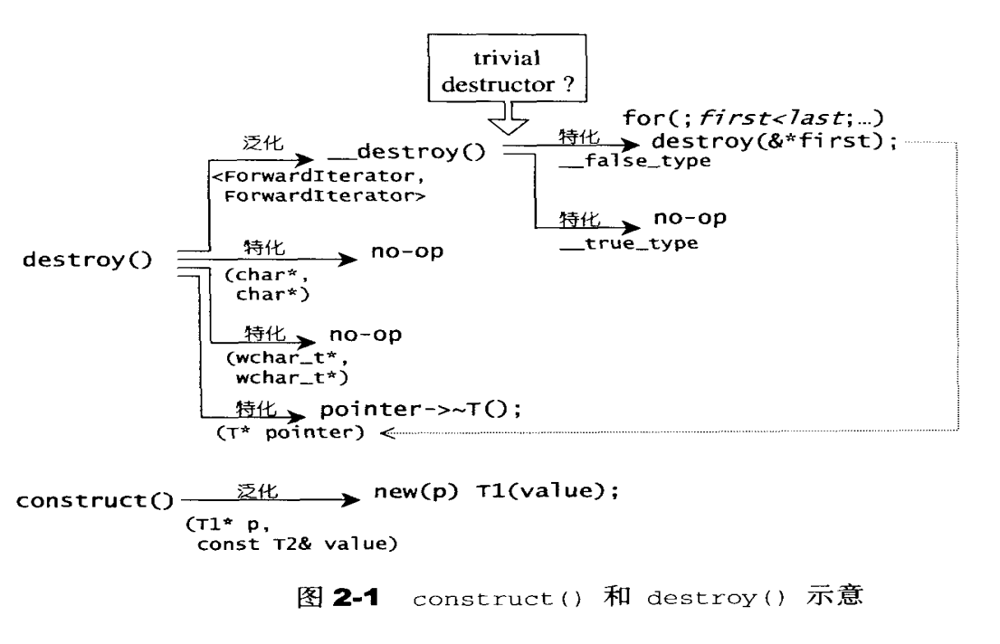
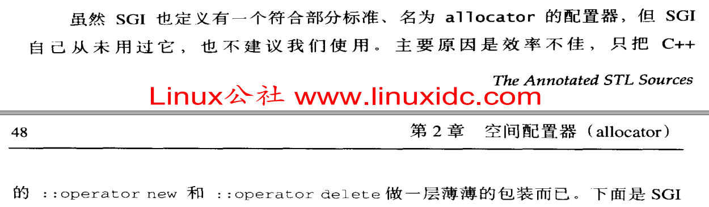
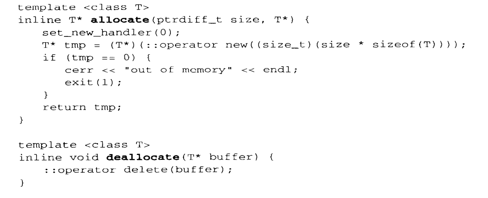

### 类的产生与消亡

1. 产生, 先分配空间, 再调用类的构造函数(`non-trival`)<br>

2. 消亡, 先调用类的析构函数(`non-trival`), 再回收空间<br>

### c++11 ::operator new

http://www.cplusplus.com/reference/new/operator%20new/<br>

1. `void* operator new (std::size_t size)` 失败时抛出`bad_alloc`异常, 注意不会返回`nullptr`<br>

2. `void* operator new (std::size_t size, const std::nothrow_t& nothrow_value) noexcept`, 失败时不会抛出`bad_alloc`异常, 但会返回`nullptr`<br>

3. `void* operator new (std::size_t size, void* ptr) noexcept`, 即`placement new`, 需要第二个参数`void* ptr`, 在此指针所指内存空间上构造出一个类, 并调用类的构造函数(`non-trival`)<br>

4. 例子:<br>
```cpp
// operator new example
#include <iostream>     // std::cout
#include <new>          // ::operator new

struct MyClass {
  int data[100];
  MyClass() {std::cout << "constructed [" << this << "]\n";}
};

int main () {

  std::cout << "1: ";
  MyClass * p1 = new MyClass;
      // allocates memory by calling: operator new (sizeof(MyClass))
      // and then constructs an object at the newly allocated space

  std::cout << "2: ";
  MyClass * p2 = new (std::nothrow) MyClass;
      // allocates memory by calling: operator new (sizeof(MyClass),std::nothrow)
      // and then constructs an object at the newly allocated space

  std::cout << "3: ";
  new (p2) MyClass;
      // does not allocate memory -- calls: operator new (sizeof(MyClass),p2)
      // but constructs an object at p2

  // Notice though that calling this function directly does not construct an object:
  std::cout << "4: ";
  MyClass * p3 = (MyClass*) ::operator new (sizeof(MyClass));
      // allocates memory by calling: operator new (sizeof(MyClass))
      // but does not call MyClass's constructor

  delete p1;
  delete p2;
  delete p3;

  return 0;
}
```

5. 当我们平常写下`new MyClass`的时候, 实际上编译器会隐式的转化为`::operator new(sizeof(MyClass))`, 然后调用`MyClass`的构造函数(`non-trival`)<br>


### c++11 ::operator delete

http://www.cplusplus.com/reference/new/operator%20delete/<br>

1. 当我们平常写下`delete MyClass`的时候, 实际上编译器会隐式的转化为先调用`MyClass`的析构函数(`non-trival`), 然后调用`::operator delete(MyClass)`<br>

2. 如果只想释放掉内存, 而不调用`MyClass`的析构函数, 则`delete((void*)MyClass)`, 即将类对象转换为`void*`类型, `g++`编译器会产生警告, 但是可以运行<br>


### stl空间配置模式
#### <<<stl源码剖析>>> p50:<br>


可以看到, 分为构造、析构、分配内存、内存回收<br>

1. 构造, 使用`placement new`<br>

2. 析构, 分为多个版本, 其中比较重要的是判断类的析构函数是否具有`trivial`属性<br>
#### <<<stl源码剖析>>> p52:<br>



3. 使用`C malloc`分配内存<br>

4. 使用`C free`释放内存<br>


### std::alloc空间配置器
#### <<<stl源码剖析>>> p55:<br>

<br>


1. 一级空间配置器, 申请内存大于`128K`的时候使用<br>

2. 二级空间配置器, 申请内存小于`128K`的时候使用, 并采用内存池来实现, 目的, 减少内存碎片和减少操作系统维护小内存块的负担<br>
#### <<<stl源码剖析>>> p59:<br>


3. 内存池提供空间:
#### <<<stl源码剖析>>> p63:<br>


4. 内存池回收空间:
#### <<<stl源码剖析>>> p65:<br>


### 为何不用std::allocator
#### <<<stl源码剖析>>> p48:<br>



1. `std::allocator`只是对`::operator new`和`::operator delete`做了一层封装<br>

2. 如何封装`allocate`和`deallocate`:<br>

#### <<<stl源码剖析>>> p48:<br>



注意, `deallocate()`中的T实际上是`void`型(如果看完书本第48页的话会看到), 所以`::operator delete(buffer)`实际上只释放内存<br>

3. 未提供类似`std::alloc`的一、二级空间配置器的功能<br>