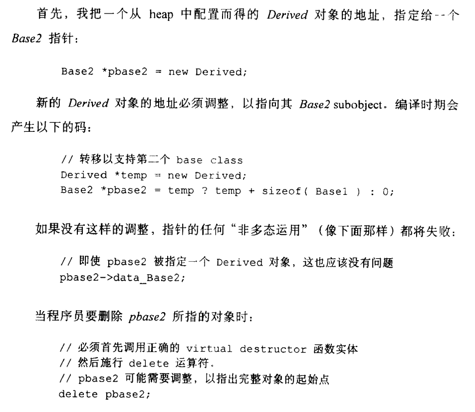
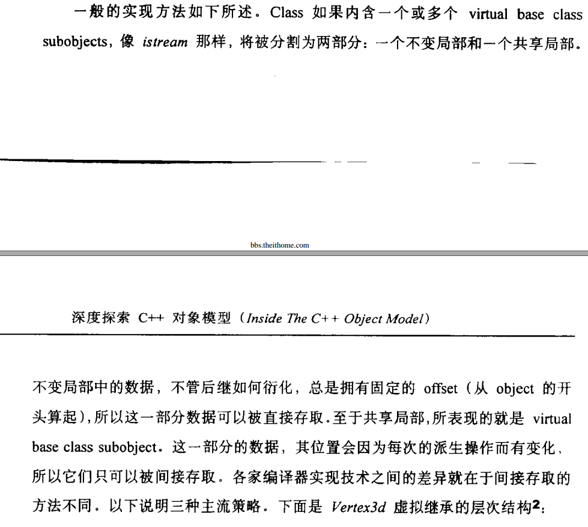
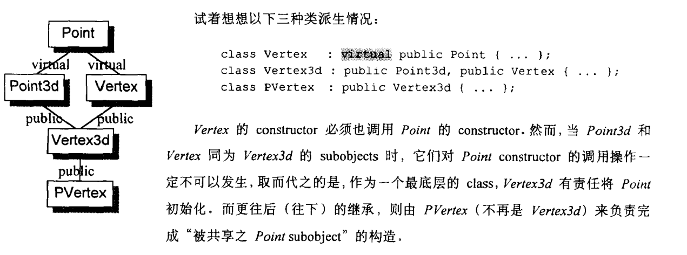
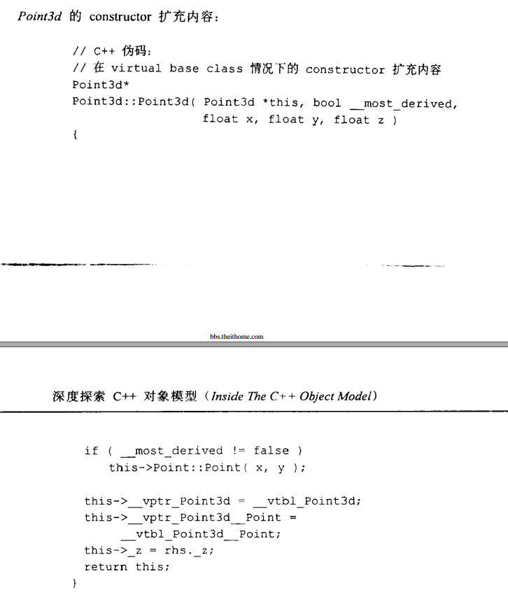
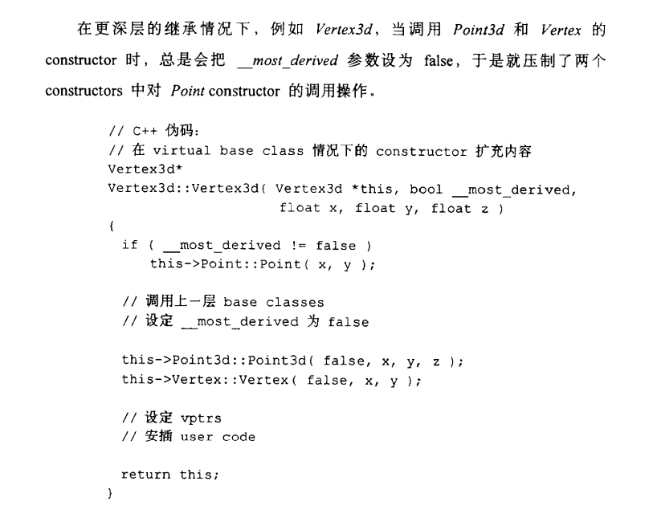
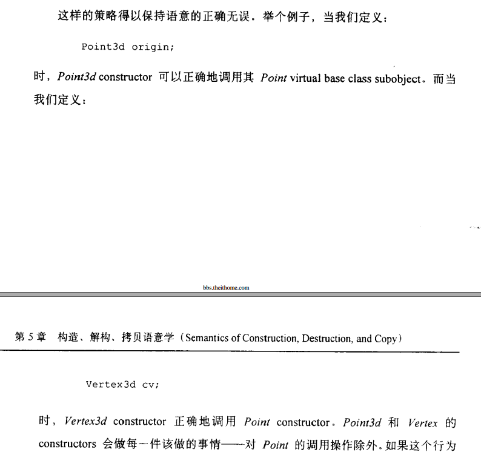

### 一 不含虚函数的非虚继承的内存布局

```cpp
class Base
{

};
class Derived: public Base
{

};
```

派生类会继承来自基类的成员(当然在public继承情况下, 只继承基类的public和protected成员)<br>

### 二 含虚函数的非虚继承的内存布局

```cpp
class Base
{
    public:
        void virtual func();
};

class Derived: public Base
{
    public:
        void virtual func();
};
```

1. 基类产生一个虚函数表, func()存在虚函数表中, 在实例化一个对象后, 对象里面包含一个指向基类虚函数表的虚表指针<br>

2. 子类也产生一个虚函数表, 如果子类没有定义func(), 则继承而来的func()存在虚函数表中, 在实例化一个对象后, 对象里面包含一个指向子类虚函数表的虚表指针<br>

3. 如果子类定义了func(), 子类虚函数表里继承而来的的func函数被覆盖<br>


### 三 虚继承, 子类不覆盖父类的虚方法

```cpp
class Base
{
    public:
        void virtual func();
};
class Derived : virtual public Base
{
    public:
        // 注意到func_1()并没有覆盖Base::func()
        void virtual func_1();
};

```


1. 注意到Derived的大小为12, 因为有三个指针, 分别为基类偏移表指针, 两个虚表指针<br>

2. vfptr为虚表指针, vbptr为指向vbtable的指针, vbtable记录了虚继承中, 基类在派生类中起始偏移地址<br>

3. 虚继承中, 基类成员被放置到了派生类布局的后端(区别与非虚继承关系中基类成员被放置到派生类布局的前端)<br>

4. 第一个vfptr虚表指针指向上图第一个虚表, 上图第一个虚表存储着派生类的虚函数func_1()<br>

5. 第二个vbptr偏移表指针指向上图第二个表(注意非虚表), 上图第二个表存储着基类在派生类中起始偏移地址<br>

6. 第三个vfptr虚表指针指向上图第三个虚表, 上图第三个虚表存储着派生类从基类继承而来的的虚函数func()<br>


### 四 虚继承, 子类覆盖父类的虚方法

```cpp
class Base
{
    public:
        void virtual func();
};
class Derived : virtual public Base
{
    public:
        // 注意到func()覆盖了Base::func()
        void virtual func();
};

```


1. 与上一种情况对比, 注意到Derived的大小为8, 因为有两个指针, 分别为基类偏移表指针, 一个虚表指针<br>

2. 第一个vbptr偏移表指针指向上图第一个表(注意非虚表), 上图第一个表存储着基类在派生类中起始偏移地址<br>

3. 第二个vfptr虚表指针指向上图第二个虚表, 上图第二个虚表存储着覆盖掉的虚函数func()<br>

4. 注意到, 当虚继承发生虚函数覆盖时, 与上一种情况对比, 派生类自己的虚表没有了(派生类没有定义其他虚函数), 与非虚继承对比, 情况似乎相同(注意这里派生类没有定义其他虚函数)<br>


### 五 如何支持多态

1. 多态的关键是:<br>

A. 派生类覆盖掉基类的虚方法<br>

B. 基类指针指向派生类对象的时候, 能够正确加上offset以指向派生类中基类的subobject<br>


2. 非虚继承<br>

```cpp
class Base1
{

};
class Base2
{

};
class Derived : public Base1, public Base2
{

};

Base2* obj = new Derived;
// 编译器将安插如下代码:
Derived* tmp = new Derived;
Base2* obj = tmp?tmp+sizeof(Base1):0;   // 加上Base1的offset
```

><<深度探索C++对象模型>> p161:<br>


如果派生类只继承一个基类, 则因为基类成员被安排在派生类对象模型的前端, offset为0, 则无需安插任何代码<br>

3. 虚继承<br>

如上面所述, 新增的vbptr指针和vbtable偏移表将支持多态行为:<br>

```cpp
class Base
{

};
class Derived : public Base
{

};

Base2* obj = new Derived;
// 编译器将安插如下代码:
Derived* tmp = new Derived;
Base2* obj = tmp?tmp->vbptr:0;     // 加上通过vbptr指向的vbtable中存储的offset值
```

A. 为什么不将Base的成员安排到Derived对象模型的前端而是安排到后端?<br>

><<深度探索C++对象模型>> p117:<br>


B. 为什么不使用sizeof(Derived)?<br>
因为这样就直接全部跳过了<br>

### 六 虚继承下的菱形继承


1. 最终派生类非虚继承<br>

```cpp
class Base
{
public:
    virtual void func();
};
class Base1 : virtual public Base
{
public:
    virtual void func_1();
};
class Base2 : virtual public Base
{
public:
    virtual void func_2();
};
// 最终派生类非虚继承
class Derived: public Base1, public Base2
{
public:
    virtual void func_3();
};
```


A. 先依次排列Base1和Base2, 注意Base被放置到了最后<br>

B. Derived只有一个虚函数func_3()被放置到了第一个虚表中<br>

C. 虚继承下的钻石继承只保存一份Base的实体(区别于非虚继承下的钻石继承会保存两份Base的实体)<br>


2. 最终派生类虚继承<br>

```cpp
class Base
{
public:
    virtual void func();
};
class Base1 : virtual public Base
{
public:
    virtual void func_1();
};
class Base2 : virtual public Base
{
public:
    virtual void func_2();
};
// 最终派生类虚继承
class Derived : virtual public Base1, virtual public Base2
{
public:
    virtual void func_3();
};
```


A. 先排列Derived的成员<br>

B. 再依次排列Base、Base1和Base2<br>


>ref:<br>
https://www.cnblogs.com/jerry19880126/p/3616999.html<br>


3. 虚继承如何解决对象构造顺序<br>

有如下对象继承关系:<br>

><<深度探索C++对象模型>> p211:<br>


1. Point3d类构造函数的扩充:<br>

><<深度探索C++对象模型>> p211:<br>


2. Vertex3d类构造函数的扩充:<br>

><<深度探索C++对象模型>> p212:<br>




3. 可以看到, 虚继承下的菱形继承中, `最终类(most derived class)`必须负责对`Base(Point)类`的构造<br>

4. 通过引入`__most_derived`变量来保证最终类依次构造父类时, 父类不会去构造`Base(Point)类`<br>


### 七 纯虚函数与抽象类

1. 定义了纯虚函数的类称为抽象类, 抽象类不能实例化对象, 只能用于继承<br>

2. 如果将析构函数定义为纯虚函数, 需要实例化此析构函数<br>