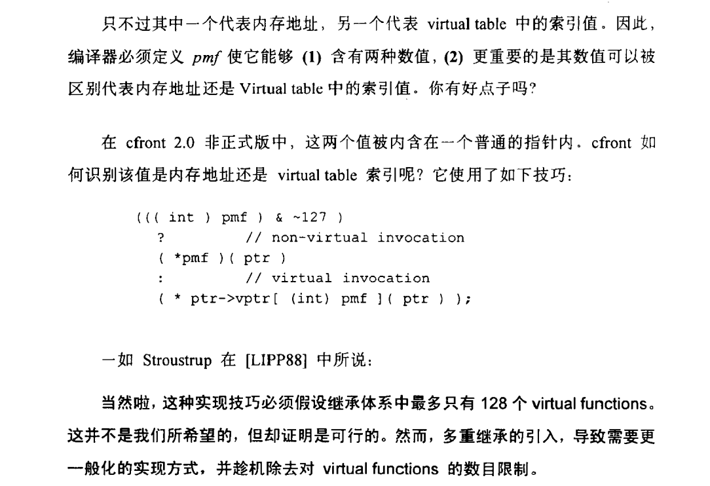

### 一 为什么析构函数不能带有参数
>ref:<br>
>https://bbs.csdn.net/topics/120022304<br>

1. 实际上有一个`this指针`参数<br>

2. 设想如果有这样的需求, 在对象析构的时候给虚构函数传递一些值以完成某些事情, 似乎是可行的<br>

3. 但是如果用户自定义了一个有参数的析构函数, 则遇到自动调用析构函数的场景(如栈对象的释放或则多态中释放基类空间的操作)将变得不可行, 因为程序无法自动决定传入的实参<br>

### 二 指向class data members和function members的指针
><<深度探索C++对象模型>> p174:<br>


示例:<br>
>file.hpp<br>
```cpp
struct MyStruct
{
    int a;
    int func();
};
```

>file.cpp<br>
```cpp
int MyStruct::func()
{
    return this->a;
}
```

`file.hpp`中定义了`MyStruct`类的定义, `file.cpp`中定义了`MyStruct`类的实现, 如果将此类编译成`so动态库`, 则`so动态库`中记录的对成员变量`int a`的操作即是记录的对`int a`在`MyStruct`布局中的`offset`下的操作, 而并非`int a`在实际内存中的地址<br>
实际`int a`地址需要`this指针`, 而`this指针`在实例化一个对象后才会出现<br>


### 三 编译器如何区分指向class virtual function members的函数指针和普通指针

><<深度探索C++对象模型>> p176:<br>


><<深度探索C++对象模型>> p178:<br>



### 四 对象和类的内存布局

><<深度探索C++对象模型>> 1.1.3:<br>

```cpp
class ZooAnimal
{
    public:
        int loc;
        // String为某个类
        String name;
}
class Bear : public ZooAnimal
{
    public:
        // Dances为某个类
        Dances dances_known;
        int cell_block;
}
class Panda : public ZooAnimal
{
    public:
        // Dances为某个类
        Dances dances_known;
        int cell_block;
}
```

1. 单一类<br>
><<深度探索C++对象模型>> p29:<br>


2. 单一继承<br>
><<深度探索C++对象模型>> p30:<br>


3. 多重继承<br>
><<深度探索C++对象模型>> p33:<br>


4. 可以看到, 类只是一个蓝图, 只有实例化一个对象后, 这个类才会表现到内存中, 而且只有成员变量才属于对象, 而成员方法是所有对象共有的(存放在代码段, 类似的, 虚表也是所有对象共有的, 但是虚表指针不是)<br>


### 五 base和derived类的函数覆盖情况

1. 如果子类定义了一个与父类同名的函数(虚或非虚函数, public), 子类可以通过`父类名.方法`的方式调用<br>

>ref:<br>
>https://blog.csdn.net/F_cff/article/details/79688509

### 六 定义拷贝构造、赋值构造和析构函数的必要性

1. 如果类成员变量都是栈对象, 则多数情况下默认的(编译器合成的)拷贝构造等函数就已经足够<br>

2. 如果类成员变量有指针类型且指向了堆内存, 则多数情况下需要自定义拷贝构造等函数以避免错误的行为(如double free)<br>

3. 参看`note <<new与vector插入元素>> `第七节<br>